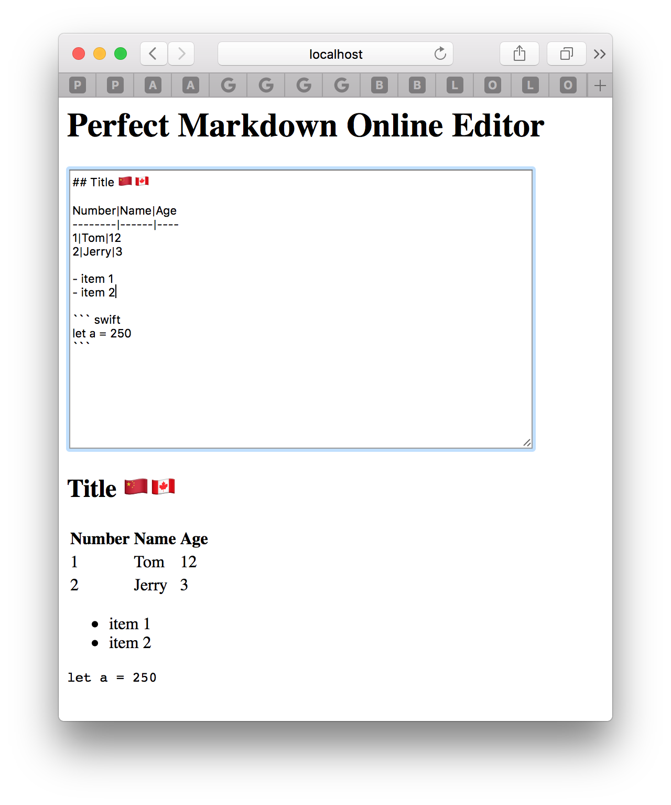

# Perfect Online Markdown Editor Demo [简体中文](README.zh_CN.md)

<p align="center">
    <a href="http://perfect.org/get-involved.html" target="_blank">
        
    </a>
</p>

<p align="center">
    <a href="https://github.com/PerfectlySoft/Perfect" target="_blank">
        
    </a>  
    <a href="http://stackoverflow.com/questions/tagged/perfect" target="_blank">
        
    </a>  
    <a href="https://twitter.com/perfectlysoft" target="_blank">
        
    </a>  
    <a href="http://perfect.ly" target="_blank">
        
    </a>
</p>

<p align="center">
    <a href="https://developer.apple.com/swift/" target="_blank">
        
    </a>
    <a href="https://developer.apple.com/swift/" target="_blank">
        
    </a>
    <a href="http://perfect.org/licensing.html" target="_blank">
        
    </a>
    <a href="http://twitter.com/PerfectlySoft" target="_blank">
        
    </a>
    <a href="http://perfect.ly" target="_blank">
        
    </a>
</p>

This project demonstrates how to build an Online Markdown Editor based on Perfect HTTP Server, Perfect WebSocket and Perfect Markdown.

Ensure you have installed and activated the latest Swift 3.1 tool chain.


## Quick Start


Follow the bash commands below to download, build and run this project:

```
$ git clone https://github.com/PerfectExamples/Perfect-Markdown-Editor.git
$ cd Perfect-Markdown-Editor
$ swift build
$ ./.build/debug/PerfectMarkdownEditor
```

If success, messages should pop out as below:

```
[INFO] Starting HTTP server localhost on 0.0.0.0:7777
```

This means you can use browser to check `http://localhost:7777`.
<p align=center></img></p>

For the tutorial purposes, this project only provides plain HTML without any render style to minimize the code. However, you can add any CSS to make it prettier.

## Project Walkthrough

The whole project is based on [PerfectTemplate](https://github.com/PerfectlySoft/PerfectTemplate.git).

### Package.swift

It is a common file required by Swift Package Manager, with key lines of components for the server:

``` swift
	.Package(url: "https://github.com/PerfectlySoft/Perfect-HTTPServer.git", majorVersion: 2),
	.Package(url: "https://github.com/PerfectlySoft/Perfect-WebSockets.git", majorVersion:2),
	.Package(url: "https://github.com/PerfectlySoft/Perfect-Markdown.git", majorVersion: 1)
```

Among these dependencies, *Perfect-HTTPServer* includes all essential functions of a Swift HTTP Server on both mac / linux; *Perfect-Markdown* is a library that enables the Swift convert Markdown string to HTML; Besides, *Perfect-WebSockets* provides WebSocket access to clients, which means that any input will get instant render feedback.

### main.swift

`main.swift` is the main entry of the server, which is a typical [PerfectTemplate](https://github.com/PerfectlySoft/PerfectTemplate.git) application. The server will provide only two routes:

- `/editor` - the WebSocket handler, i.e., incoming WebSocket requests will be processed as program below:

``` swift
public class EditorHandler: WebSocketSessionHandler {

  public let socketProtocol : String? = "editor"

  // This function is called by the WebSocketHandler once the connection has been established.
  public func handleSession(request: HTTPRequest, socket: WebSocket) {

    socket.readStringMessage { input, _, _ in

      guard let input = input else {
        socket.close()
        return
      }//end guard

      // translate markdown to HTML, just one line code
      let output = input.markdownToHTML ?? ""

		// send the HTML back to socket
      socket.sendStringMessage(string: output, final: true) {
        self.handleSession(request: request, socket: socket)
      }//end send
    }//end readStringMessage
  }//end handleSession
}//end Handler
```

- `/` - the root handler, i.e., a static HTML home page, but client user behaviour - type any markdown into the input box and immediately translate to HTML - is controlled by a small piece of WebSocket script embedded in the HTML:

``` javascript
var input, output;
function init(){
	input = document.getElementById('textInput');
	output = document.getElementById('results');
	// create a socket and point it to the current server with api "/editor" and protocol "editor" (can be different names)
	sock = new WebSocket('ws://' + window.location.host + '/editor', 'editor');
	sock.onmessage = function(evt) { output.innerText = evt.data; }
}//end init
function send() {
	sock.send(input.value);
}
```

## Issues

We are transitioning to using JIRA for all bugs and support related issues, therefore the GitHub issues has been disabled.

If you find a mistake, bug, or any other helpful suggestion you'd like to make on the docs please head over to [http://jira.perfect.org:8080/servicedesk/customer/portal/1](http://jira.perfect.org:8080/servicedesk/customer/portal/1) and raise it.

A comprehensive list of open issues can be found at [http://jira.perfect.org:8080/projects/ISS/issues](http://jira.perfect.org:8080/projects/ISS/issues)

## Further Information
For more information on the Perfect project, please visit [perfect.org](http://perfect.org).


## Now WeChat Subscription is Available (Chinese)
<p align=center></p>
