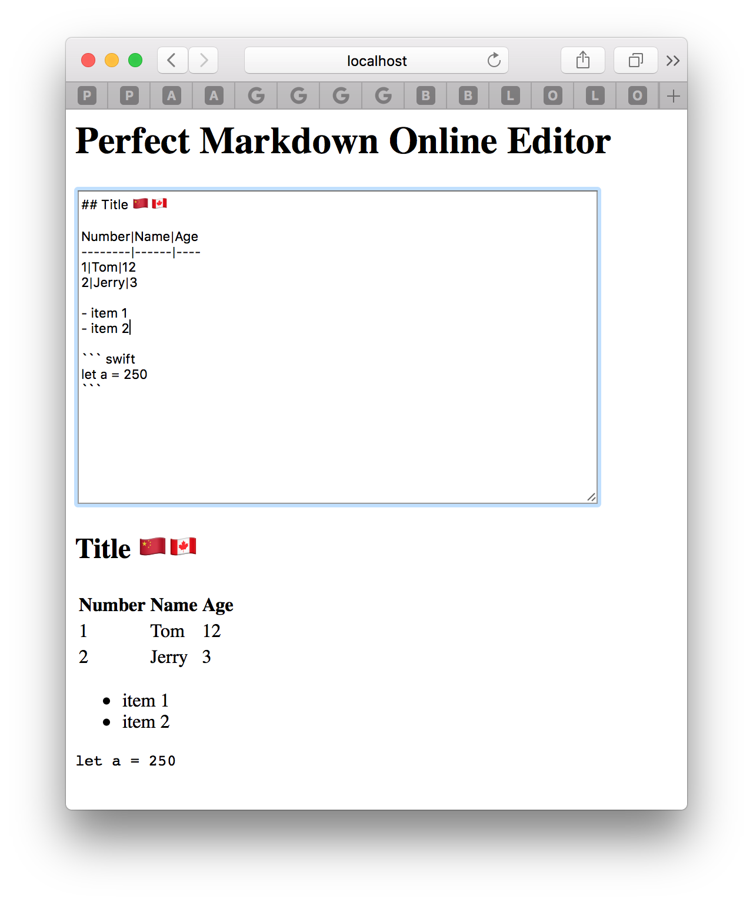

# Perfect Markdown 在线编辑器代码示范 [English](README.md)

<p align="center">
    <a href="http://perfect.org/get-involved.html" target="_blank">
        
    </a>
</p>

<p align="center">
    <a href="https://github.com/PerfectlySoft/Perfect" target="_blank">
        
    </a>  
    <a href="http://stackoverflow.com/questions/tagged/perfect" target="_blank">
        
    </a>  
    <a href="https://twitter.com/perfectlysoft" target="_blank">
        
    </a>  
    <a href="http://perfect.ly" target="_blank">
        
    </a>
</p>

<p align="center">
    <a href="https://developer.apple.com/swift/" target="_blank">
        
    </a>
    <a href="https://developer.apple.com/swift/" target="_blank">
        
    </a>
    <a href="http://perfect.org/licensing.html" target="_blank">
        
    </a>
    <a href="http://twitter.com/PerfectlySoft" target="_blank">
        
    </a>
    <a href="http://perfect.ly" target="_blank">
        
    </a>
</p>

本项目展示了如何使用Perfect HTTP服务器、Perfect Markdown渲染组件和Perfect WebSocket搭建一个在线的Markdown文本编辑器。

请确保您的系统已经安装了Swift 3.1工具链。

## 完整教学视频

关于本案例完整的教学视频请参考这里：[99行Swift完成Markdown在线编辑服务器](https://v.qq.com/x/page/b0395mf2no1.html)

## 快速上手

请使用下列bash命令下载、编译和运行本项目：

```
$ git clone https://github.com/PerfectExamples/Perfect-Markdown-Editor.git
$ cd Perfect-Markdown-Editor
$ swift build
$ ./.build/debug/PerfectMarkdownEditor
```
如果运行成功，则终端会显示：

```
[INFO] Starting HTTP server localhost on 0.0.0.0:7777
```

这意味着服务器已经成功启动，现在您可以使用浏览器查看地址`http://localhost:7777`，如下图所示：

<p align=center></img></p>

作为教学程序，这里采用了没有任何附加页面特效和色彩的素颜HTML，以将代码简化到最为容易理解的程度。当然您可以随时将喜爱的CSS主题加入到源程序。

## 源代码简介

本项目是在 [PerfectTemplate](https://github.com/PerfectlySoft/PerfectTemplate.git) 基础上编制完成的。

### Package.swift

即SPM软件包管理器在编译项目时标准的源程序，核心代码如下：

``` swift
	.Package(url: "https://github.com/PerfectlySoft/Perfect-HTTPServer.git", majorVersion: 2),
	.Package(url: "https://github.com/PerfectlySoft/Perfect-WebSockets.git", majorVersion:2),
	.Package(url: "https://github.com/PerfectlySoft/Perfect-Markdown.git", majorVersion: 1)
```

上述依存关系中， *Perfect-HTTPServer* 包括了启动一个Swift语言在 mac / linux 上开发HTTP服务器的所有必要功能；而 *Perfect-Markdown* 用于Swift语言将Markdown字符串转换为HTML文本。最后的 *Perfect-WebSocket* 用于服务器支持HTML5/WebSocket扩展。

### main.swift

`main.swift` 是该服务器的门户入口，是一个典型的[PerfectTemplate](https://github.com/PerfectlySoft/PerfectTemplate.git) 模板程序。该服务器只提供两个路由资源：

- `/editor ` - WebSocket 处理器，即能够处理来自浏览器端的 WebSocket 请求：

``` swift
editor` - the WebSocket handler, i.e., incoming WebSocket requests will be processed as program below:

``` swift
public class EditorHandler: WebSocketSessionHandler {

  public let socketProtocol : String? = "editor"

  // 如果窗口关闭等事件发生则需要关闭socket
  public func handleSession(request: HTTPRequest, socket: WebSocket) {

    socket.readStringMessage { input, _, _ in

      guard let input = input else {
        socket.close()
        return
      }//end guard

      // 就这一行代码，把输入的Markdown内容转换为HTML
      let output = input.markdownToHTML ?? ""

		// 将转化好的HTML文本返回给客户端
      socket.sendStringMessage(string: output, final: true) {
        self.handleSession(request: request, socket: socket)
      }//end send
    }//end readStringMessage
  }//end handleSession
}//end Handler
```

- `/` - 根路由，即一个静态的HTML主页页面。但是客户端的行为 - 输入任何Markdown内容都可以立刻看到HTML渲染效果 - 是由在该主页中嵌入的一小段 WebSocket 脚本控制的。

``` javascript
var input, output;
function init(){
	input = document.getElementById('textInput');
	output = document.getElementById('results');
	//这一句话是创建WebSocket，并且将目标指向当前服务器，采用/editor路由和editor协议（碰巧重名）
	sock = new WebSocket('ws://' + window.location.host + '/editor', 'editor');
	sock.onmessage = function(evt) { output.innerText = evt.data; }
}//end init
function send() {
	sock.send(input.value);
}
```

### 问题报告、内容贡献和客户支持

我们目前正在过渡到使用JIRA来处理所有源代码资源合并申请、修复漏洞以及其它有关问题。因此，GitHub 的“issues”问题报告功能已经被禁用了。

如果您发现了问题，或者希望为改进本文提供意见和建议，[请在这里指出](http://jira.perfect.org:8080/servicedesk/customer/portal/1).

在您开始之前，请参阅[目前待解决的问题清单](http://jira.perfect.org:8080/projects/ISS/issues).

## 更多信息
关于本项目更多内容，请参考[perfect.org](http://perfect.org).

## 扫一扫 Perfect 官网微信号
<p align=center></p>
